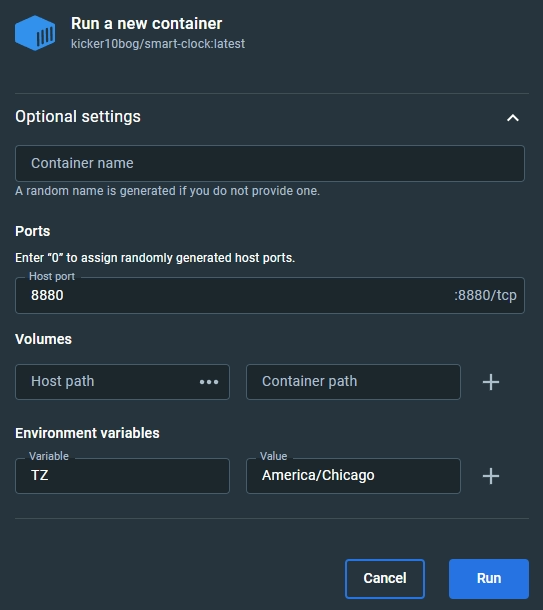

# Smart Clock
A web server for that allows you to have a smart clock in your browser with alarms.

V 1.0

It uses Cherrypy as the web server with jinja templates and bootstrap 5 elements. 

You can set multiple alarms with different names. Each alarm can be set to repeat on various days and can be toggled on or off at any time. You can also set the snooze length, time format, whether or not it shows the seconds, and whether or not it shows the date. 

The clock is designed to look good on a 10-inch tablet, so keep that in mind. You should be able to use ctrl+ or ctrl- to zoom in and out though. 

I probably won't be updating it much, but it works well as it is. There may be a new version at some point that uses Vue or something else though. 

## Installation

### Docker
This is the recommended way to run it. 

The following commands should have you up and running. Just be sure to set the correct timezone. You can find a list of time zones [here](https://en.wikipedia.org/wiki/List_of_tz_database_time_zones). You may also change the first 8880 to anything over 1024 if you are already using port 8880 for something else. 

```docker pull kicker10bog/smart-clock```

```docker run -e TZ=America/Chicago -d -p 8880:8880 kicker10bog/smart-clock```

If you're using Docker Desktop, search for `kicker10bog/smart-clock` and pull it. Then start it and set the port and timezone like in this screenshot.



Now go to `localhost:8880` and your clock should be there. 

### Manually (Linux)
If you'd rather not use docker, you can install it using the source code.

Install git.
``` sudo apt install git```

Make sure python 3 is installed. It might work with other versions, but I know it works with 3.9.
```sudo apt install python3```

Clone this repository. 
```git clone https://github.com/kicker10BOG/SmartClock.git```

Go into the repository.
```cd SmartClock```

Then install the dependencies. 
```pip3 install -r requirements.txt```

Now you should be able to run it with the following command. 
```python3 SmartClock.py```

And going to `localhost:8880` in a browser should take you to the clock. 

However, if you're not using docker, I suggest running it as a service, so create a file at `/etc/systemd/system/smart-clock.service` with the following command. 
```sudo nano /etc/systemd/system/smart-clock.service```

And add this as the contents.
```
[Unit]
Description=Smart Clock Web Server
After=network.target
StartLimitIntervalSec=0

[Service]
Type=simple
Restart=always
RestartSec=1
User=pi
WorkingDirectory=/home/pi/SmartClock
ExecStart=/usr/bin/python3 SmartClock.py

[Install]
WantedBy=multi-user.target
 ```

Of course, if the repository is in another location, then change the `WorkingDirectory` to reflect that. And change `User` to your username. 

Now reload the daemon and enable the smart clock, then start it. 
```
sudo systemctl daemon-reload
sudo systemctl enable smart-clock
sudo systemctl start smart-clock 
 ```

And going to `localhost:8880` in a browser should take you to the clock. 